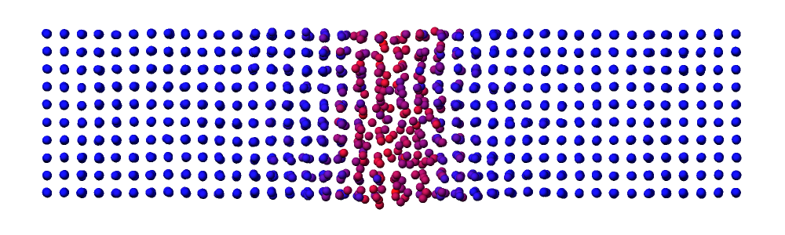

# Project: “God made the bulk; the surface was invented by the devil” : Can machine learning handle the interface?

**Reference:** Simon Gravelle, Irina Piazza

**Quote:** Wolfgang Pauli

**Objective:** Investigate solid-liquid coexistence in aluminum and compare the ability of an EAM potential and an MLIP to describe the melting temperature and dynamics of a solid-liquid interface.

Tools & Libraries (visit https://github.com/simongravelle/DIADEM or click on the links below): 

- [LAMMPS GUI](https://github.com/simongravelle/DIADEM/blob/main/README.md)
- Provided [starting input file](https://github.com/simongravelle/DIADEM/blob/main/project/input.lmp) (a cubic FCC crystal)
- Provided [EAM potential](https://github.com/simongravelle/DIADEM/blob/main/project/Al-2009.eam.alloy)
- Provided [MLIP potential](https://github.com/irina-piazza/MLIP-diadem-summer-school-2026) (created during Wednesday morning session by Irina Piazza)

**Instructions:**

- Start from the provided cubic FCC crystal and modify the box dimension to elongate it.
- Create a solid-liquid coexistence configuration using two thermostats: a hot region to melt part of the crystal and a cold region to maintain the solid phase.
- Visualize the solid and liquid phases using the [centrosymmetry parameter](https://docs.lammps.org/compute_centro_atom.html).
- Turn off the two thermostats, and replace them with a single thermostat. Observe whether the crystal grows, shrinks, or the two phases coexist.
- Replace the EAM potential with the MLIP potential and repeat the same experiment.
- Compare the interface evolution and discuss whether the MLIP reproduces the same behavior as the EAM potential.

**Question:** Does the MLIP potential, which was learned from bulk phases rather than from interfaces, still reproduce the solid-liquid coexistence behavior of the EAM potential ?

